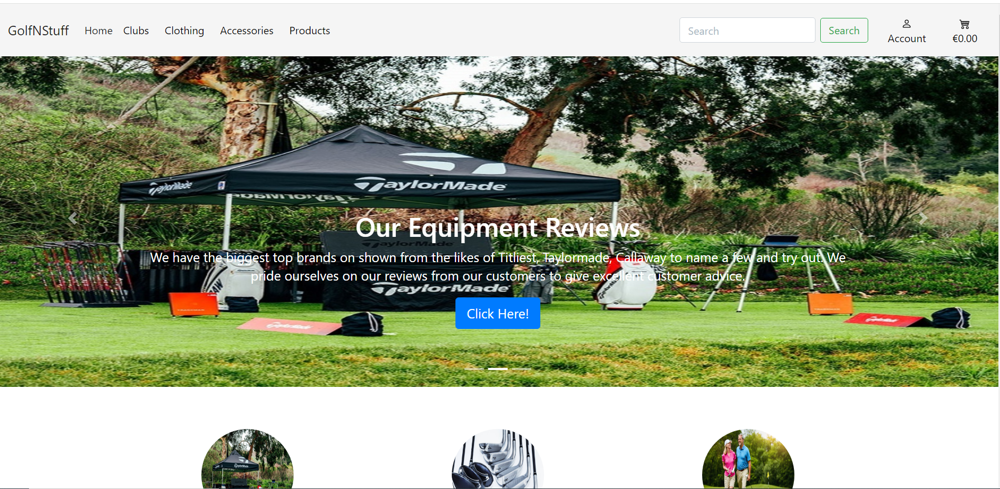
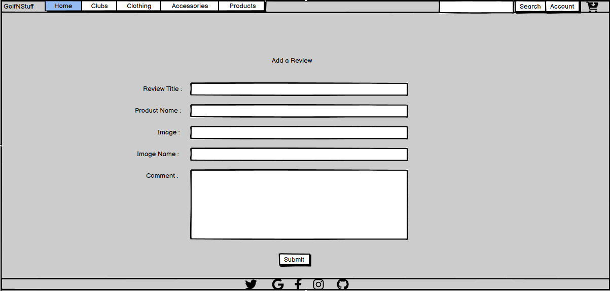
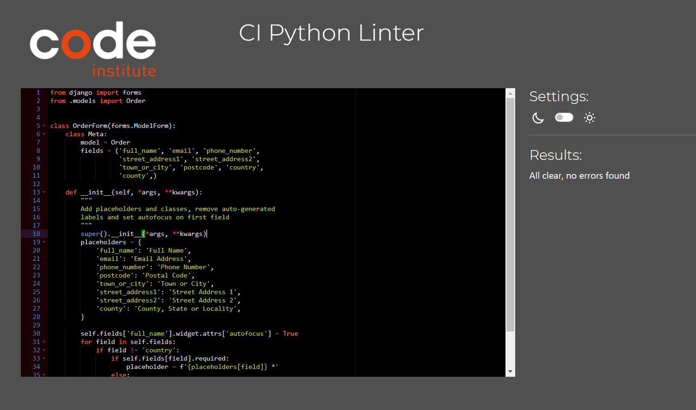
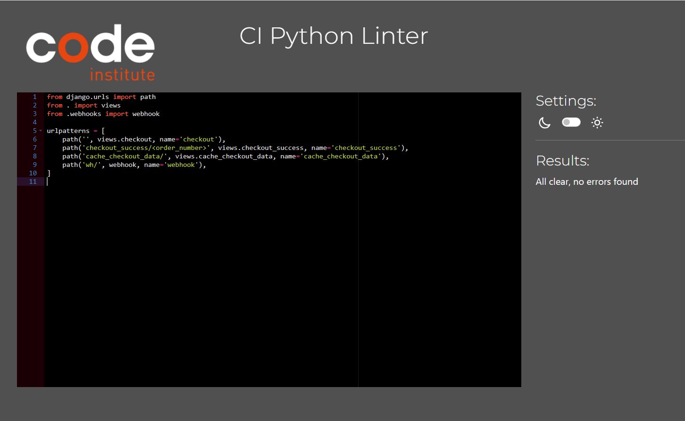
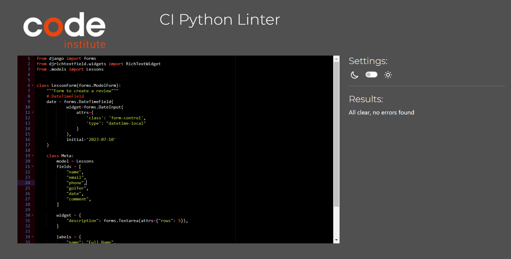

# GolfNStuff

GolfNStuff is the one stop shop for all your needs, with top brands to suit every golfer whether your are young or old starting out for the first time or a low handicap golfer, we can provide the best equipment for your tailored needs with a first class service and top professional to give your advice.

This link is the live version of GolfNStuff (https://golfnstuff-ee9465ae2158.herokuapp.com)

# UX

## Database Structure

- Database Schema

Model

- Reviews Model

- Lessons Model

- Contact Model

- Profile Model

- Checkout Model

- Products Model

## UX Design

Overview

Design

- The design is to make it easy for the user to navigate.
- Simplify the website to be user friendly.

Site User

- An expert or a beginner.

Goals for the website

- Is to educate and gain knowlege of golf equipment.
- To give and gain experience of what's the best equipment for the golfer to buy.
- Share learning experiences of golf equipment.

## Agile Development

Agile Overview

The project is created along side the GITHUB repository to create milestone and issues that are A MUST HAVE in the projects. To keep track of what needs to be implemented within the project, a bit like building blocks along the way with different elements required to have a fully working website.

This is the link to the User Stories - (https://github.com/users/firefox35/projects/18/views/1)

User Stories

A User Story is a piece of functionality the needs to be installed along the way to produce a working website.

1. [USER STORY: Create project in workspace](https://github.com/firefox35/GolfnStuff/issues/1)
2. [USER STORY: Create a User Account](https://github.com/firefox35/GolfnStuff/issues/2)
3. [USER STORY: Create Admin Account](https://github.com/firefox35/GolfnStuff/issues/3)
4. [USER STORY: Create Homepage](https://github.com/firefox35/GolfnStuff/issues/4)
5. [USER STORY: Create a Header](https://github.com/firefox35/GolfnStuff/issues/5)
6. [USER STORY: Create a Footer](<https://github.com/firefox35/GolfnStuff/issues/6>)
7. [USER STORY: Create a README file](https://github.com/firefox35/GolfnStuff/issues/7)
8. [USER STORY: Create Products page](https://github.com/firefox35/GolfnStuff/issues/8)
9. [USER STORY: Create a Search Functionality](https://github.com/firefox35/GolfnStuff/issues/9)
10. [USER STORY: Sorting Products](https://github.com/firefox35/GolfnStuff/issues/10)
11. [USER STORY: Book a Lesson](https://github.com/firefox35/GolfnStuff/issues/11)
12. [USER STORY: Create a Reviews Section](https://github.com/firefox35/GolfnStuff/issues/12)
13. [USER STORY: Contact Form](https://github.com/firefox35/GolfnStuff/issues/13)
14. [USER STORY: Create a Shopping Cart](https://github.com/firefox35/GolfnStuff/issues/14)
15. [USER STORY: Create a checkout process](https://github.com/firefox35/GolfnStuff/issues/15)
16. [USER STORY: Create a Facebook page](https://github.com/firefox35/GolfnStuff/issues/16)
17. [USER STORY: Create a email newsletter](https://github.com/firefox35/GolfnStuff/issues/17)
18. [USER STORY: Book a Lesson Part 2](https://github.com/firefox35/GolfnStuff/issues/18)
19. [USER STORY: Contact Us Part 2](https://github.com/firefox35/GolfnStuff/issues/19)

# Features

User Based Features Implemented

- A user can create an Account.
- A user can add both a product and a review.
- A user can delete both a product and a review.
- A user can edit both a product and a review.
- A user can read the details of both the product and the reviews.
- A user can delete its account.
- A user can view each screen as a member.

Account Restrictions

- To access the review list you have to register an account.
- To access the review details you have to register an account.
- To access the site you must login with username and password.

Website Features

- Search bar
  
  
## Site Wide

Header

- Displays the name of the company and links to our products.

  

Navigation Menu

- The navigation is very simple to the website, once you fill out the registration form your able to purchase item otherwise you would only be able to view the products on the website.
- In the home screen there is home button will you back to the home screen.

Footer

- Facebook Link on the Footer brings you to it's Facebook Live Page
- <https://www.facebook.com/profile.php?id=61557411004879>

    

- Email Subscription uses MailChimp

    
  - 
 - Facebook, Mailchimp, X, Google, Instagram, Linkedin and Github.

    
  
500 Error

- Broken link to pages.
- Error was due to load static not added to html pages.

### Home Screen

- Home Screen Image

  - The user is shown with an introduction of a golfer hitting a golf ball on the course which is symbols that this is a for another that is interested in golf.

- Home Screen Description

  - The user is shown a screen that has a carousel of images with brief description on them with different links on the header and also the links on the display page of the home screen and footer to social media links as well.

- Home Screen Images 
    - Carousel 1
    

    - Carousel 2
    

    - Carousel 3
    

    - Home Screen
    

    - Home Screen
    

    - Home Screen
    

    - Home Screen
    

### About Screen

- About Screen Image

  - The user is shown with an image of a fairway in the background.

- About Screen Description

  - The user is shown a title and description of the history of the website

    

## Product Page

- Product Screen Image

  - The user is shown with an image with a dimples of a golf ball.

- Product Screen Description

  - The user is shown with a selection of golf equipment with a description below on card that's happen when you submit the form to add a product.

## Product Detail Page

- Product Screen Image

  - The user is shown with an image with a dimples of a golf ball.

- Product Screen Description

  - The user is shown with the detailed description of the product they have selected.

## All Product Page

- Product Screen Image

  - The user is shown with an image with a dimples of a golf ball.

- Product Screen Description

  - The user is shown can view all products and sort by price etc..

## Review Product Details Page

- Add Review Screen Image

  - The user is shown with an image with a dimples of a golf ball.

- Add Review Screen Description

  - The user is displayed with the review card on the screen and to read detail by must click on it.

## Review Details Page

- Review Detail Screen Image

  - The user is shown with an image with a dimples of a golf ball.

- Review Detail Screen Description

  - The user is displayed with the a full description of the product and an image.
  

## Add a Review Page

- Review Screen Image

  - The user is shown with an image with a dimples of a golf ball.

- Review Screen Description

  - The user is displayed with a form to enter a review on the screen and submit the information.

## Register Page

  - The user is shown with an image with a dimples of a golf ball.

- Add Review Screen Description

  - The user is displayed with a registration form to enter details on the screen and submit the information.

## Sign In Page

- Login Screen Image
  - The user is shown with an image with a dimples of a golf ball.

- Login Screen Description

  - The user is displayed with a login form to enter details on the screen and submit the information.
  

## Book a Lession Page

- Book a Lesson Screen Image
  - The user is shown with an image of a pink bottle of wine and a glass on the table with a silhouette that given tranquil setting.

- Book a Lesson Screen Description
  - The user is displayed with a form to enter a wine on the screen and submit the information.
  

## Contact Us Page

- Contact Us Screen Image

  - The user is shown with an image a marble background.

- Contact Us Screen Description

  - The user is displayed with the a full description of the wine and an image.
  

## Extra Features

- Search Function on the header.
- Social Media Links on the footer.

## Future Implementation

- I'm planning to make the booking a lesson and the contact us forms to have a more responsive reply back system.
- Plan to do automated testing.

## Design

Wireframes - Balsamiq.com

- Home Screen

  

- About Screen

  

- Review Screen

  

- Review Detail Screen

  

- Add Review Screen

  

- Contact Us Screen

  

- Book a Lesson Screen

  

- Checkout Screen

  

- Register Screen

  

- Product Screen

  

- Product Detail Screen

  

## Technologies

HTML

- Hypertext Markup Language is the main language to create the structure of the website.

CSS

- Cascading Style Sheets is used to style your content in an external file.

JavaScript

- Object Oriented programming language that interacts with the web browser.

Python

- Python is an interpreted, object-oriented, high-level programming language with dynamic semantics.

Django

- Django is a high-level Python web framework that encourages rapid development and clean, pragmatic design.

Github

- This is used to create and store your source code as a backup if you lose your application.
- <https://github.com/firefox35/GolfnStuff>

Git

- Git is the language used to submit your source code to the repository.

GitPod.io

- Is the application where you create your website in file structures.

Heroku

- Heroku is a platform as a service (PaaS) that enables developers to build, run, and operate applications entirely in the cloud.

ElephantSQL

- ElephantSQL is a PostgreSQL database hosting service.
  - <https://api.elephantsql.com/>
  
Bootstrap 5

- Its used to style the frontend framework with Django

PostgresSQL

- It is a highly stable database management system

Balsamqi.com

- This application was used to create mockups for the Heavenly Wines website.
  - <https://balsamiq.com/wireframe>

Website Mockup Generator

- This application was used to create images of the Heavenly Wines website in desktop, laptop, tablet and mobile devices.
- <https://websitemockupgenerator.com>

Resize images

- This application was used to resize images of the Heavenly website in desktop, laptop, tablet and mobile devices.
- <https://www.resizepixel.com/>

Mail Chimp 
- This application allow you to create a email newsletter subscription form on the footer.
- <https://login.mailchimp.com>

Temp Mail

- This website provides you with an email address temporarily to test out your credentials when creating an account on a website.
- <https://temp-mail.org/en/view/65f77cba11063a006aa1e5e1>

Stripe

-  Stripe is a payment application the collect payment when checkout and purchasing on the website.
-  <https://dashboard.stripe.com/>

DBeaver

-  This application can attach to you elephant database and create ER Diagram.
-  <https://dbeaver.io/>

Navigation

Home Screen

- Home Screen Buttons : They consist on the header the following
  - Home : The home button applies to all website pages to bring you to the home page.
  - Reviews : This view shown the reviewed wine card that can be clicked to show the detail of the wine.
  - Comment : The user enters where they can add a review of a wine.
  - Register : Sign up to become a member.
  - Login : Enter User credentials
  - Learn More : This brings you to the about page.

Review Screen

- The review shown on the screen once clicked will brings you to the Description of the review. where you can edit or delete.

# Testing

Responsiveness

Responsiveness was tested on screen sizes from 320px on Chrome, Edge, Firefox and Opera browsers.

Steps to test:

1. Open browser and navigate to [GolfNStuff](https://golfnstuff-ee9465ae2158.herokuapp.com/)
2. Open the developer tools (right click and inspect)
3. Set to responsive and decrease width to 320px
4. Set the zoom to 50%
5. Click and drag the responsive window to maximum width

Expected:

No issues regards with overlapping, images and links

Result:

No issue to report.

Accessibility

The following criteria were met for testing.

- All navigation links accessibility
- Text or titles descriptions are visible.
- Heading level are not missed.
- HTML page attribute has been set.

Manual testing performed as expected and accessible.

## Lighthouse Testing

- index.html

- reviews.html
  

### Functional Testing

#### Navigation Links

- Perform testing was carried out on navigation links and found to be working perfectly by the way of clicking each buttons

|   Navigation    |      Page to Load          |
|-----------------|----------------------------|
|  Home Screen    |  index.html                |
|  Reviews Screen |  reviews.html              |
|  Comment Screen |  add_review.html           |
|  Detail Screen  |  review_detail.html        |
|  Delete Screen  |  review_confirm_delete.html|
|  Edit Screen    |  edit_review.html          |
|  About Screen   |  about.html                |

#### Website Testing

-The website was tested to ensure its functionality was correctly working.

-The following test scenarios were covered.

#### TEST 1 - [GolfNStuff](https://github.com/firefox35/GolfnStuff/)

|          Description            |            Steps                       |Expected | Result  |
|---------------------------------|----------------------------------------|---------|---------|
| Navigation Links on Home Screen | 1. Home Screen Button.                 | Passed  | &check; |
|                                 | 2. Clubs Dropdown Menu Button.         | Passed  | &check; |
|                                 | 3. Clothing Dropdown Menu Button.      | Passed  | &check; |
|                                 | 4. Extra Dropdown Menu Button.         | Passed  | &check; |
|                                 | 5. Products Dropdown Menu Button.      | Passed  | &check; |
|                                 | 6. Account Dropdown Menu Button.       | Passed  | &check; |
|                                 | 7. Checkout Screen Button.             | Passed  | &check; |
|                                 | 8. Sign Up Screen Button.              | Passed  | &check; |
|                                 | 9. Reviews Screen Button.              | Passed  | &check; |
|                                 | 10. Book a Lesson Screen Button.       | Passed  | &check; |
|                                 | 11. About Us Screen Button.            | Passed  | &check; |
|                                 | 12. Equipment Feedback Screen Button.  | Passed  | &check; |
|                                 | 13. Contact Us Screen Button.          | Passed  | &check; |
|                                 | 14. All Dropdown Sub Menu Buttons.     | Passed  | &check; |

#### TEST 2 - [GolfNStuff](https://github.com/firefox35/GolfnStuff/)

|          Description           |            Steps       |  Expected | Result  |
|--------------------------------|------------------------|-----------|---------|
| Navigate Links to Social Media.| 1. Facebook Link       | Passed    | &check; |
|                                | 2. Twitter/ X Link     | Passed    | &check; |
|                                | 3. Google Link         | Passed    | &check; |
|                                | 4. Instagram Link      | Passed    | &check; |
|                                | 5. Linkedin Link       | Passed    | &check; |
|                                | 6. Github Link         | Passed    | &check; |

#### TEST 3 - [GolfNStuff](https://github.com/firefox35/GolfnStuff/)

|      Description   |       Steps        | Expected | Result  |
|--------------------|--------------------|----------|---------|
| Account Access     | 1. Register a user | Passed   | &check; |
|                    | 2. Login a user    | Passed   | &check; |
|                    | 3. Logout a user   | Passed   | &check; |

#### TEST 4 - [GolfNStuff](https://github.com/firefox35/GolfnStuff/)

|          Description        |            Steps         | Expected | Result |
|-----------------------------|--------------------------|----------|--------|
| Product Form Working        | 1. Add Title             | Passed   | &check;|
|                             | 2. Add Product Name      | Passed   | &check;|
|                             | 3. Add Comment           | Passed   | &check;|
|                             | 4. Add Image             | Passed   | &check;|
|                             | 5. Add Image Name        | Passed   | &check;|
|                             | 6. Click Submit Button   | Passed   | &check;|
|                             | 7. Add Image             | Passed   | &check;|
|                             | 8. Add Image Decription  | Passed   | &check;|
|                             | 9. Click Submit Button   | Passed   | &check;|

#### TEST 5 - [GolfNStuff](https://github.com/firefox35/GolfnStuff/)

|          Description             |            Steps            | Expected | Result |
|----------------------------------|-----------------------------|----------|--------|
| The User can remove or edit post | 1. The user can delete post | Passed   | &check;|
| on both product                  | 2. The user can edit post   | Passed   | &check;|

#### TEST 6 - [GolfNStuff](https://github.com/firefox35/GolfnStuff/)

|          Description        |            Steps         | Expected | Result |
|-----------------------------|--------------------------|----------|--------|
| Review Feedback Form Working| 1. Add Title             | Passed   | &check;|
|                             | 2. Add Product           | Passed   | &check;|
|                             | 3. Add Image             | Passed   | &check;|
|                             | 4. Add Image Name        | Passed   | &check;|
|                             | 5. Add Comment           | Passed   | &check;|
|                             | 6. Click Submit Button   | Passed   | &check;|
|                             | 7. Add Image             | Passed   | &check;|
|                             | 8. Add Image Decription  | Passed   | &check;|
|                             | 9. Click Submit Button   | Passed   | &check;|

#### TEST 6 - [GolfNStuff](https://github.com/firefox35/GolfnStuff/)

|   Description   |              Steps                  | Expected | Result |
|-----------------|-------------------------------------|----------|--------|
| The Search Bar  | 1. The user can use the search bar  | Passed   | &check;|

#### TEST 7 - [GolfNStuff](https://github.com/firefox35/GolfnStuff/)

|   Description         |            Steps                                                             | Expected | Result |
|-----------------------|------------------------------------------------------------------------------|----------|--------|
| Details of the Review | 1. The user can click the product to view the details from the review screen.| Passed   | &check;|

## Validation Testing

### Python Validation - PEP8

[CI Python Linter](https://pep8ci.herokuapp.com/#) was used to validate the Python files that were created or edited by myself.

| Features | Admin  | Models | Urls   | Views  | Tests  |  Apps   | Contexts| Passed All Validation |
|----------|--------|--------|--------|--------|--------|---------|---------|-----------------------|
|  Cart    ||||||||&check;|

| Features | Admin  | Forms  | Models | Urls   | Views  | Tests  |  Apps   | Webhooks | Webhook Handler | Init | Signals |Passed All Validation |
|----------|--------|--------|--------|--------|--------|--------|---------|----------|-----------------|------|---------|---------------|
| Checkout ||||||||||||&check; |

| Features | Admin  | Forms  | Models | Urls   | Views  | Tests  |  Apps   | Passed All Validation | 
|----------|--------|--------|--------|--------|--------|--------|---------|-----------------------|
| Contact  ||||||||&check; |

| Features | Admin  | Models | Urls   | Views  | Tests  |  Passed All Validation   |  
|----------|--------|--------|--------|--------|--------|--------------------------|
|   Home   ||||||&check; | 

| Features | Admin  | Forms  | Models | Urls   | Views  | Tests  |  Apps   | Passed All Validation | 
|----------|--------|--------|--------|--------|--------|--------|---------|-----------------------|
|  Lessons |none |none |none |none |none |none |none  |&check; |

| Features | Admin  | Forms  | Models | Urls   | Views  | Tests  |  Apps   | Widgets | Passed All Validation | 
|----------|--------|--------|--------|--------|--------|--------|---------|---------|-----------------------|
| Products |||||||||&check;|

| Features | Admin  | Forms  | Models | Urls   | Views  | Tests  |  Apps   | Passed All Validation | 
|----------|--------|--------|--------|--------|--------|--------|---------|-----------------------|
| Profiles ||||||||&check; |

| Features | Admin  | Forms  | Models | Urls   | Views  | Tests  |  Apps   | Passed All Validation | 
|----------|--------|--------|--------|--------|--------|--------|---------|-----------------------|
| Reviews  ||||||||&check;|

### Javascript Validation

[JSHint](https://jshint.com/) was used to validate the JavaScript code added to the project.

| Files | Images | Passed Vaildation |
|-------|--------|-------------------|
|cart.html||&check;|
|stripe_elements.js||&check;|
|quantity-input-script.html||&check;|
|add-products.html||&check;|
|edit-products.html||&check;|
|products.html||&check;|
|base.html||&check;|

### HTML Validation

  - index.html

    

### CSS Validation

  [W3C CSS Validator](https://jigsaw.w3.org/css-validator/) was used to validate my CSS files.

  | CSS Files   |      Images       | Passed Validation |
  |-------------|-------------------|-------------------|
  | bass.css    || &check; |
  | checkout.css|| &check; |
  | profile.css || &check; |
  | review.css  || &check; |
   
- Unfixed Bugs

  - Responsiveness of the website worked on all devices and screen sizes

## Header & Footer Icons/Links

- Facebook Link
  
  - <https://www.facebook.com/profile.php?id=61557411004879>
  
- X Link
  
  - <https://twitter.com/>

- Google Link
  
  - <https://www.google.com/>

- Instagram Link
  
  - <https://www.instagram.com/>
  
- Linkedin Link

  - <https://www.linkedin.com/>

- GitHub Link

  - <https://www.github.com/>

# Deployment

To deploy the Heroku:

- Sign up / Log in to Heroku -
- From the main Heroku Dashboard page select New.
- Click on Create New App.
- I gave my project a Heavenly Wines.
- Select E.U as the region.
- Click Create app.
- It must be a vaild name of the your app.
- Heroku will create the app.
- It take you to the deploy tab.
- At Deployment Method.
- Click on Github
- At App connected to Github
- Click to search and connect to your repository.
- In the Sttings tab.
- Click on the Config Vars- Reveal Config Vars
- In it add the following config vars
 -AWS_URL
 -DATABAE_URL
 -HEROKU_HOSTNAME
 -SECRET_KEY
-paste in the value to each

- In Django create a new file called env.py
- os.environ["DATABASE_URL"]= "Paste the link in here"
- os.environ["SECRET_KEY"] = "your secret key goes here"
- os.environ["AWS_URL"] = "paste in the Url copied to the clipboard here"
- In the settings.py file
- Add the following
- import Path from pathlib, import os and import dj_database_url
   os.path.isfile("env.py"): import env
- Add the AWS libraries to the list of installed apps in order of important. 
-'AWS_S3_Bucket' goes above 'django.contrib.staticfiles' and 'AWS' goes below it.
- Link the file to the templates directory in Heroku TEMPLATES_DIR = os.path.join(BASE_DIR, 'templates')
- Change the templates directory to TEMPLATES_DIR - 'DIRS': [TEMPLATES_DIR]
- Add Heroku to the ALLOWED_HOSTS list.
- Create Procfile and add the following code - web: guincorn PROJECT_NAME.wsgi
- To the deploy in Heroku go to the Deploy tab and deploy the branch manually.
- Once it has completed the build process it should successfully deploy to view the site live

Version Control

Deployment of Live Version from Github

The website was created using GitPod.io editor and the code was pushed to a repository in GitHub called GolfNStuff.

I used the following GitHub commands to push the code to the repository, every time a chance is made to the code. This is what they called version control. Its basically a backup version of your code if anything goes wrong.

git add - This command is basically saving your code

git commit -m "Commit Message"

git push

The live link can be found here - <https://golfnstuff-ee9465ae2158.herokuapp.com/>

Clone the Repository Code Locally

The site was deployed to GitHub pages. The steps to deploy are as follows:
In the GitHub repository, navigate to the Settings tab
From the menu on left select 'Pages'
From the source section drop-down menu, select the Branch: main
Click 'Save'
A live link will be displayed in a green banner when published successfully.
The live link can be found here - <https://golfnstuff-ee9465ae2158.herokuapp.com/>

# Credits

## Websites

Django: how to read the db_column name of a model field

- <https://stackoverflow.com/questions/5243222/django-how-to-read-the-db-column-name-of-a-model-field>

Drop Down Menu/Text Field in one

- <https://stackoverflow.com/questions/18309059/drop-down-menu-text-field-in-one>

How do I connect forms to models in Django?

- <https://stackoverflow.com/questions/60708043/how-do-i-connect-forms-to-models-in-django>

How to get Django form field from model field?

- <https://stackoverflow.com/questions/2584141/how-to-get-django-form-field-from-model-field>

Want to allow user to to pick datetime using the django model and forms.

-<https://stackoverflow.com/questions/58424734/want-to-allow-user-to-to-pick-datetime-using-the-django-model-and-forms>

How do I safely delete a model field in Django?

- <https://stackoverflow.com/questions/68442018/how-do-i-safely-delete-a-model-field-in-django>

Need help with Date Time Picker

- <https://forum.djangoproject.com/t/need-help-with-date-time-picker/16988>

How to display model attributes in django on web app.

- <https://stackoverflow.com/questions/72998637/how-to-display-model-attributes-in-django-on-web-app>

Django - getting Error "Reverse for 'detail' with no arguments not found. 1 pattern(s) tried:" when using 

- <https://stackoverflow.com/questions/47944443/django-getting-error-reverse-for-detail-with-no-arguments-not-found-1-patt>

Creating forms from models

- <https://docs.djangoproject.com/en/5.0/topics/forms/modelforms/>

Django Admin Page Edit App Names

- <https://forum.djangoproject.com/t/django-admin-page-edit-app-names/14720>

Stream a file as an HTTP Response with Bun

- <https://bun.sh/guides/http/stream-file>

You are trying to add a non-nullable field 'new_field' to userprofile without a default

- <https://stackoverflow.com/questions/26185687/you-are-trying-to-add-a-non-nullable-field-new-field-to-userprofile-without-a>

Django Crispy Forms saying Image Field is required even though it is filled

- <https://www.reddit.com/r/django/comments/10moa44/django_crispy_forms_saying_image_field_is/>

CommandError: No fixture named 'myapp' found

- <https://stackoverflow.com/questions/45165389/commanderror-no-fixture-named-myapp-found>

Django: ImproperlyConfigured: The SECRET_KEY setting must not be empty

- <https://stackoverflow.com/questions/19128540/django-improperlyconfigured-the-secret-key-setting-must-not-be-empty>

csrf verification error for django admin login

- <https://forum.djangoproject.com/t/csrf-verification-error-for-django-admin-login/11785>

Check for pending Django migrations

- <https://stackoverflow.com/questions/31838882/check-for-pending-django-migrations>

How to change Model name in Django Admin Panel.

- <https://www.youtube.com/watch?v=IwC9c6UR29w>

Django admin list display

- <https://www.youtube.com/watch?v=uJrQMsLJWys>

How to silence “Invalid HTTP_HOST header” error?

- <https://forum.djangoproject.com/t/how-to-silence-invalid-http-host-header-error/9826>

Deploying Django To Heroku - Server Error (500)

- <https://stackoverflow.com/questions/44221653/deploying-django-to-heroku-server-error-500>

How can my django form grab current username and email and submit them into another database table?

- <https://stackoverflow.com/questions/69387635/how-can-my-django-form-grab-current-username-and-email-and-submit-them-into-anot>

get request data in Django form

- <https://stackoverflow.com/questions/1202839/get-request-data-in-django-form>

How to get value from form field in django framework?

- <https://stackoverflow.com/questions/4706255/how-to-get-value-from-form-field-in-django-framework>

I want to add user's id on the url path or in the address of the page

- <https://stackoverflow.com/questions/68273837/i-want-to-add-users-id-on-the-url-path-or-in-the-address-of-the-page>

Django form based view GET response

- <https://stackoverflow.com/questions/33678171/django-form-based-view-get-response>

django how to set background colour in html based on context

- <https://stackoverflow.com/questions/54102214/django-how-to-set-background-colour-in-html-based-on-context>

ImproperlyConfigured: settings.DATABASES is improperly configured. Please supply the ENGINE value

- <https://stackoverflow.com/questions/26080303/improperlyconfigured-settings-databases-is-improperly-configured-please-supply>

Django error: The value of 'list_filter[2]' refers to 'is_active', which does not refer to a Field.?

- <https://stackoverflow.com/questions/61407155/django-error-the-value-of-list-filter2-refers-to-is-active-which-does-no>

Forbidden 403 | CSRF verification failed Request aborted | window 11 | 2022 updated | Django error

- <https://www.youtube.com/watch?v=alcZVag5Zhc>

Django Add Link to Details

- <https://www.w3schools.com/django/django_add_link_details.php>

Django CSRF_TRUSTED_ORIGINS not working as expected

- <https://stackoverflow.com/questions/70508568/django-csrf-trusted-origins-not-working-as-expected>

Heroku Bad Request Server 400 Error

- <https://community.cloudflare.com/t/heroku-bad-request-server-400-error/160887>

How to Fix ModuleNotFoundError No Module Named Error In ...

- <https://www.google.com/search?sca_esv=590295209&rlz=1C1CHBF_enIE1013IE1013&sxsrf=AM9HkKnnzkm3XRvcfG_sBCB0YX_44-Tadw:1702418873346&q=ModuleNotFoundError:+No+module+named+%27wines.forms%27&tbm=vid&source=lnms&sa=X&ved=2ahUKEwiin9HB9IqDAxV-VUEAHSoDCH0Q0pQJegQIDBAB&biw=1360&bih=651&dpr=1#fpstate=ive&vld=cid:206a160d>,vid:OAywo1HbEEc,st:0

Working with forms

- <https://docs.djangoproject.com/en/5.0/topics/forms/>

Improperly Configured(“settings.DATABASES is improperly configured.

- <https://forum.djangoproject.com/t/improperlyconfigured-settings-databases-is-improperly-configured/16870>

Bad Request (400) on heroku - Where to look ?

- <https://www.reddit.com/r/django/comments/2848gb/bad_request_400_on_heroku_where_to_look/?rdt=52833>

CSS styles do not apply correctly on deployed app

- <https://community.fly.io/t/css-styles-do-not-apply-correctly-on-deployed-app/9999>

django.db.migrations.exceptions.InconsistentMigrationHistory

- <https://stackoverflow.com/questions/44651760/django-db-migrations-exceptions-inconsistentmigrationhistory>

django-allauth 0.59.0

- <https://pypi.org/project/django-allauth/>

csrf verification failed. request aborted. Django

- <https://www.google.com/search?q=csrf+verification+failed.+request+aborted.+django&rlz=1C1CHBF_enIE1013IE1013&oq=CSRF+verification+failed.+Request+aborted.&gs_lcrp=EgZjaHJvbWUqDAgBECMYJxiABBiKBTIGCAAQRRg5MgwIARAjGCcYgAQYigUyBwgCEAAYgAQyBwgDEAAYgAQyBwgEEAAYgAQyBwgFEAAYgAQyBwgGEAAYgAQyBggHEEUYQdIBCDIwMDFqMGo3qAIAsAIA&sourceid=chrome&ie=UTF-8>

Django admin login suddenly demanding csrf token

- <https://stackoverflow.com/questions/29573163/django-admin-login-suddenly-demanding-csrf-token>

Bootstrap5 and django?

- <https://forum.djangoproject.com/t/bootstrap5-and-django/23773/5>

Django cannot find static files. Need a second pair of eyes, I'm going crazy

- <https://stackoverflow.com/questions/24199029/django-cannot-find-static-files-need-a-second-pair-of-eyes-im-going-crazy>

Install, uninstall, and upgrade Python packages

- <https://www.jetbrains.com/help/idea/installing-uninstalling-and-upgrading-packages.html>

App model doesn't appear in Django admin in production

- <https://lightrun.com/answers/cookiecutter-cookiecutter-django-app-model-doesnt-appear-in-django-admin-in-production>

django-richtextfield 1.6.1

- <https://pypi.org/project/django-richtextfield/>

## Video’s

Django User-Registration Form | sign-up | How To Create ...

- <https://www.google.com/search?q=how+to+create+registration+form+in+python+django&rlz=1C1CHBF_enIE1013IE1013&oq=how+to+create+booking+form+with+django&gs_lcrp=EgZjaHJvbWUqCAgCEAAYFhgeMgYIABBFGDkyCAgBEAAYFhgeMggIAhAAGBYYHjIICAMQABgWGB4yCAgEEAAYFhgeMg0IBRAAGIYDGIAEGIoFMg0IBhAAGIYDGIAEGIoFMg0IBxAAGIYDGIAEGIoF0gEJMjE4OTdqMGo3qAIAsAIA&sourceid=chrome&ie=UTF-8#fpstate=ive&vld=cid:6b8e67d0,vid:bOwC5e9cIXw,st:0>

Populate/Insert Existing Data in Django Models

- <https://www.youtube.com/watch?v=TL6qLQoJLsw>

Add, Remove, and modify fields (with non-required values) | Django ORM Model Essentials

- <https://www.youtube.com/watch?v=oZy3cOWgLgY>

How to Easily Style Your Django Form Fields With Django Widget Tweaks

- <https://www.youtube.com/watch?v=ynToND_xOAM>

Python Django Multiple HTML Pages Configure Routing (urls.py)

- <https://www.youtube.com/watch?v=1jcjuV2StxQ>

HTML : How can one set a background image in a Django Template?

- <https://www.youtube.com/watch?v=Ndb4-Gi4vIw>

How to Receive Data From a Django Form Using a POST Request (Django Tutorial) | Part 46

- <https://www.youtube.com/watch?v=wzZiONbtwiA>

How to verify the Email Address of the user in Django 2020 || The Codrammers

- <https://www.youtube.com/watch?v=KEdrtb9RMHM>

Two ways to use ERD in DBeaver

- <https://www.youtube.com/watch?v=770M9AB9LIM>
  
Django Lesson 6: Advanced URL Patterns

- <https://www.youtube.com/watch?v=JJNtrbodjkg>

How to make a website with Python and Django - BUILD A CONTACT PAGE WITH DJANGO FORMS 

- <https://www.youtube.com/watch?v=94ylwr2r3Hs>
  
How to make a website with Python and Django - BASICS 

- <https://www.youtube.com/watch?v=rA4X73E_HV0>

